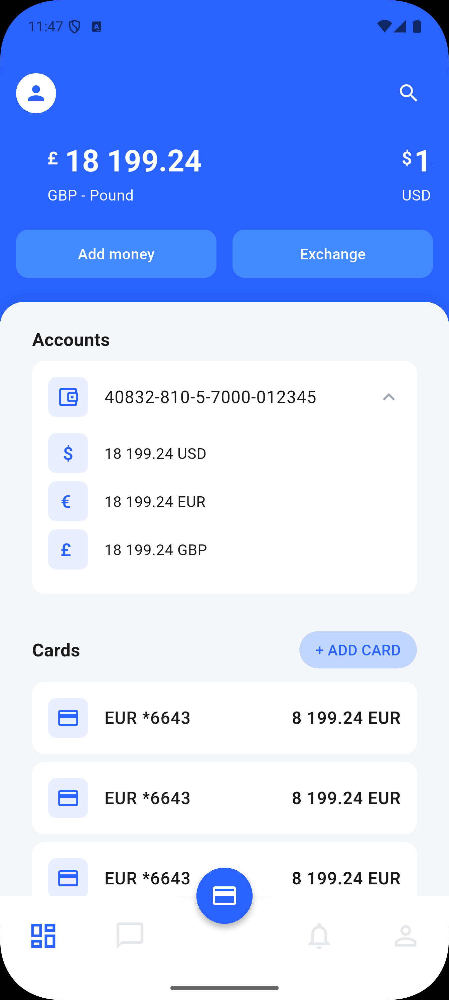

# Kast Practical Test

A Flutter demo app for viewing accounts, cards, and balances. Built with a clear structure, theme-based UI, and no external state/navigation packages.

---

## Screenshots

| Home (Dashboard)                     | Card Details                                         |
| ------------------------------------ | ---------------------------------------------------- |
|  |  |

---

## What This Project Is

- **Home screen** with a bottom tab bar: Dashboard, Messages, Notifications, Profile. Dashboard shows account balances (swipeable), accounts list, and cards list.
- **Card details screen** for a selected card: balance, card visual, and an Operations / History tab.
- **Other screens** (Add Card, Transfer, Settings, etc.) are stubbed and reachable via navigation.

All of this is wired with **mock data** only (no backend).

---

## What I Did (Summary for Interviewers)

1. **Structure**
   - Split code into `core/` (theme, navigation, state, constants, utils), `data/` (models, mock data), and `presentation/` (screens, widgets). Reusable widgets live under `presentation/widgets/`.

2. **State**
   - One place for app state: `AppState` with `ValueNotifier`s (accounts, cards, selected bottom-nav index). Provided via an `InheritedWidget` (`AppStateProvider`). No Bloc/Provider/Riverpod.

3. **Navigation**
   - Named routes and a single `AppRouter` for `onGenerateRoute`. `NavigationService` holds the global navigator key so any code can push/pop. Bottom bar is **tab switching** (same route, different content), not stack navigation.

4. **Theme & UI**
   - All colors and text styles come from `ThemeData` and a custom `ThemeExtension` for extra colors. No hardcoded `AppColors` in UI; font sizes live in the theme so the app scales from one place.

5. **Responsiveness**
   - One helper: `responsivePadding(context)` (and `isCompact`) so horizontal padding adapts by width. Used across screens for consistent side margins.

6. **Copy & Reuse**
   - All user-facing strings live in `AppStrings` (one place for text). For real localization/i18n we could plug in [easy_localization](https://pub.dev/packages/easy_localization). Shared UI pieces: `BalanceDisplay` (symbol + amount + currency label), `SectionHeader`, list items for accounts/cards/operations.

7. **Mock data**
   - Centralized in `data/mock/` (accounts, cards, operations). Loaded once at startup into `AppState`.

---

## Project Structure (High Level)

```
lib/
├── main.dart                 # App entry, AppStateProvider, mock data load
├── core/
│   ├── constants/            # app_strings, app_colors, app_dimensions, responsive
│   ├── navigation/           # app_routes, app_router, navigation_service
│   ├── state/                # app_state (ValueNotifiers + provider)
│   ├── theme/                # app_theme, app_color_extension
│   └── utils/                # currency_formatter
├── data/
│   ├── models/               # account, balance, card, operation
│   └── mock/                 # mock_accounts, mock_cards, mock_operations
└── presentation/
    ├── screens/              # home (tabs: dashboard, messages, notifications, profile),
    │                         # card_details, add_card, settings, transfer, etc.
    └── widgets/              # bottom_nav, buttons, common (balance_display, section_header),
                              # list_items (operation_list_item)
```

---

## How to Run

- **Requirements:** Flutter SDK (see `pubspec.yaml` for SDK constraint).
- **Commands:**
  - `flutter pub get`
  - `flutter run` (pick a device or simulator)

No env vars or API keys; everything runs on mock data.

---

## Tech Choices in Short

| Area           | Choice                              | Why                                                   |
| -------------- | ----------------------------------- | ----------------------------------------------------- |
| State          | `ValueNotifier` + `InheritedWidget` | Simple, no extra packages, easy to follow.            |
| Navigation     | Named routes + `NavigationService`  | Central place to navigate; easy to test or swap.      |
| Theming        | `ThemeData` + `ThemeExtension`      | One place for colors and text; UI stays consistent.   |
| Responsiveness | Single padding helper               | Enough for this demo without a full layout framework. |

---

## Scaling to production

This demo keeps dependencies minimal. For production apps, the same structure can be extended with:

- **State management** — Replace `ValueNotifier` + `InheritedWidget` with **Bloc** or **Riverpod** for clearer flows, testability, and scaling.
- **Responsiveness** — Use **LayoutBuilder** / **OrientationBuilder** for layout changes by size or orientation, or [flutter_screenutil](https://pub.dev/packages/flutter_screenutil) for design-based scaling (e.g. `.w`, `.h` from a design size).
- **Localization** — `AppStrings` centralizes copy today; for multiple languages use [easy_localization](https://pub.dev/packages/easy_localization) (JSON/CSV, plurals, RTL, codegen).
